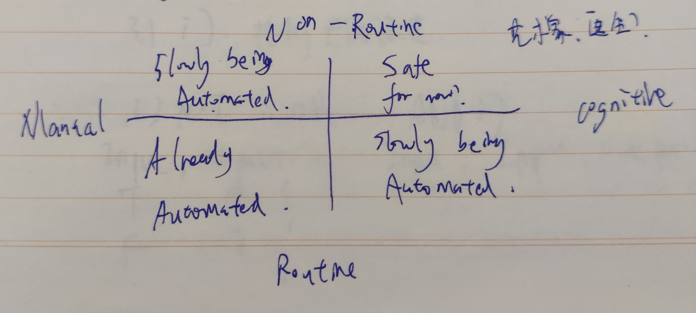

# 1. 计算机早期历史

## 1.1 影响 

- 农业自动化、医疗设备
- 全球通信、教育机会
- AI、VR、自动驾驶

# 1.2 实质

简单组件通过一层层抽象做出复杂操作

# 1.3 历史

算盘（2500BC）-> Computation概念（1613BC） -> 步进计算器（1694） -> 计算表（1694~1900）-> 分析机（19世纪中期）-> 打孔卡片（1890）

# 2. 电子计算机发展史

继电器 -> 真空管 -> 晶体管  
1944, IBM, ELectro-Mechanical Computer (1秒3次加减，6秒1次乘，15秒减法)

1943, 巨人一号, Electronic Computer, 可编程

1946, ENIAC, 通用, 可编程

1947, 晶体管

# 3. 布尔逻辑与逻辑门

## 3.1 门

控制电流流过

## 3.2 NOT OR AND

## 3.3 XOR

相同为false，不同为true  
~(A^B)^(AvB)

# 4. 二进制

## 4.1 Computers today use 32-bit color graphics

## 4.2 浮点数 IEEE754

32-bit floating point:

1-bit sign + 8-bit exponent + 23-bit significand  

## 4.3 ASCII

1963, 7 bit, 128 different values

a - 97, A - 65, : - 58

## 4.4 Unicode

1992, 16 bit, 解决不同国家标准问题

# 5. 算数逻辑单元

## 5.1 ALU

### 算术单元

由Adder, Full-Adder组成  
Overflow: 有限空间内无法储存过大的数

### 逻辑单元
Input A, Input B (8 bits)  
Oper Code(4 bits)  
Output (8 bits)  
Flags(overflow, zero, negative)

# 6. 寄存器与内存

## 6.1 And-or Latch
存1位的数据

## 6.2 Gate Latch
数据载入 + 允许写入线

## 6.3 寄存器

并排使用门锁，存储多位数据  
A group of latches operating like this is called a register, which holds a single number and the number of bits in a register is called its width

## 6.4 门锁矩阵

## 6.5 多路复用器

## 6.6 内存

将一堆独立的存储模块组成内存方块，n个内存方块组成内存模块

# 7. 中央处理器

## 7.0 基本概念 "微体系框架"
## 7.1 工作原理
### 7.1.1 必要组件

- 指令表给CPU支持的所有指令分配ID
- 控制单元
    - 指令地址寄存器
    - 指令寄存器

### 7.1.2 过程
取码，解码，执行

## 7.2 时钟
负责CPU执行的节奏， 以精确的间隔触发电信号

时钟速度: CPU执行 "取指令 -> 解码 -> 执行"中每一步的速度，以Hz为单位

# 8. 指令和程序

计算机指令长度不够用？
- 用更多位表示指令  e.g., 32, 64
- 可变的指令长度 e.g., HALT被遇到马上执行 JUMP IMMEDIATE

# 9. 高级CPU设计

## 9.1 提升CPU性能

- 加快晶体管速度
- 专门除法+其他电路

## 9.2 Cache
- 解决延迟（不让CPU等数据）
- 可以当临时空间存储一些中间值
- 脏位：储存在缓存中与RAM不一致的数据
- 空等原因：RAM到CPU数据传输有延迟

## 9.3 缓存同步

## 9.4 缓存流水线

"取码 -> 解码 -> 执行"三个步骤并行执行指令

原本需要3个时钟周期，现在只需要一个

*提前弄清数据依赖性，避免出问题；乱序执行，预测分支

## 9.5 同时处理多条指令

## 9.6 同时运行多个指令流（多核CPU）

多个独立处理单元共享一些资源

## 9.7 多个CPU（超级计算机）

# 10. 早期编程方式

## 10.1 早期

1881, 认为输入"程序" 打控纸带，插线板  
最早的编程：雅卡尔织布机

## 10.2 现代
冯诺依曼计算机：
- CPU(ALU)
- 寄存器(数据)
- 寄存器(指令)
- 寄存器(指令地址)
- 内存

Altair 8800 第一款商业成功的计算机

# 11. 编程语言发展史

## 11.1 伪代码，汇编器，助记符

## 11.2 机器码

## 11.3 汇编器（1940s~1950s）
读取"汇编语言"写的程序，转成"机器码"  
mnemonic 助记符 = opcode, followed by operand  
patch 补丁

## 11.4 Arithmetic Language Version 0
1950s 'A-0' 第一款高级汇编语言

## 11.5 Fortran
1957, IBM 相同程序比汇编短20倍，但只能运行在同一种电脑上

## 11.6 Cobol
1959, Cobol编译器，什么电脑都能运行相同代码

## 11.7 黄金年代
1960s, LGOL, LISP, Basic  
1970s, Pascal, C, SmallTalk  
1980s, C++, Objective-C, Perl  
1990s, Python, Ruby, Java  
2000s, C#, Swift, Go  

# 12. 编译原理

Statement  
- Variable assignment
    - Expression
    - Declaration
- Control flow

# 13. 算法入门

程序 = 数据结构 + 算法  
Dijkstra: O(nlogn + c) (Fibonacci heap used)

# 14. 数据结构
结构体: 把几个有长度的变量存在一起

# 15. 阿兰图灵

## 15.1 可判定性问题
是否存在一种算法, 输入正确逻辑语句，输出准确的"是"或"否"的答案?

## 15.2 lambda算子

## 15.3 图灵机
有足够的规则、状态、纸带，可解决一切计算问题。和图灵机一样完备，被称为图灵完备

## 15.4 停机问题（无法解决）
（悖论）证明图灵机不能解决所有问题  
"Limits of Computation" 可计算理论

## 15.5 图灵测试

# 16. 软件工程
## 16.1 OOD

把函数打包成对象，封装组件，隐藏复杂度，选择性的公布功能

## 16.2 API, Documentation, IDE

## 16.3 Debugging
## 16.4 Version Control
## 16.5 QA
## 16.6 Alpha(内部测试)/Beta(公测)

# 17. 集成电路&摩尔定律

Every 2 years, Fit twice the number of transistors into the sake amount of space

进一步小型化的问题？
- 光的波长限制，精度已到极限
- 量子隧穿效应

# 18. 操作系统

## 18.1 操作系统（OS）
操作硬件的特殊软件，也可以运行和管理其他程序的程序

## 18.2 批处理
当计算机运行完一个程序，会自动运行下一个

## 18.3 外部设备

## 18.4 设备驱动程序
操作系统充当软件和硬件之间的媒介。具体来说，操作系统提供程序接口（API）来抽象硬件，叫“设备驱动程序”。程序员可以用标准化机制，和输入输出（I/O）硬件交互

## 18.5 多任务处理

多个程序在CPU上同时进行

## 18.6 虚拟内存

## 18.7 动态内存分配
内存大小可灵活增减

## 18.8 内存保护
给每个程序分配单独内存，当程序出现混乱时，不影响到其他程序，同时也能防止恶意程序篡改其他程序

## 18.9 多用户分时操作系统

## 18.10 Unix
OS
- Kernel 内核，内存管理，多任务输入/输出管理
- 有用的工具

# 19. 内存和储存介质

## 19.1 非永久性 Non-Peermanent Memory
也叫volatile，易失性储存器

## 19.2 Non-volatile Storage

### 19.2.1 纸带
读取慢，难修改，难存临时值，易破坏

### 19.2.2 Delay Line Memory

1949, EDVAC "Stored-Program Computers"
不嫩随意调出数据，男增加内存密度（得等到下一次循环）

### 19.2.3 磁芯 Megnatic Tape
成本高

### 19.2.4 磁带 Tape Drive
访问速度慢

### 19.2.5 磁鼓 Magnetic Drum

### 19.2.6 硬盘
IBM RAMAC 305, First computer with a diskdrive

### 19.2.7 软盘 Floppy Disk
便捷

### 19.2.9 光盘

### 19.2.10 固定硬盘 Solid State Disk

# 20. 文件系统

## 20.1 File Format
比随机存更方便，便于管理，整齐

## 20.2 Txt
用ASCII解码

## 20.3 WAV
元书库（如bitrate）store在Header，共前44 字节存的振幅

## 20.4 Bitmap(BMP)
存RGB（每个8bit， 255种数据）

## 20.5 目录文件 Directory File
存其他文件的信息，开头，结尾，时间等

## 20.6 平面文件系统

解决紧密排列造成的问题
- 把空间分成一块块的
- 文件拆分在多个块里（有点像虚拟内存）

## 20.7 碎片整理 Defragmentation

计算机把文件调换位置，防止打开过慢

# 21. 压缩
## 21. 1 Run-length Encoding
减少重复信息

e.g., [xxx][xxx][xxx] -> 3[xxx]

## 21.2 无损压缩
## 21.3 Huffman Tree & Dictionary Loaders

按频率排列，低的在下面，每个分支用{0, 1}标准编码，变成字典

## 21.4 有损编码
## 21.5 感知编码
e.g., 音频文件，人类听不到的舍弃；Jpeg，删掉差不多的

## 21.6 时间冗余
MPEG-4, 很多图片构成时间冗余。进阶的视频会找到帧与帧之间的相似性然后打补丁

# 22. 命令行界面

## 22.1 人机交互发展史
## 22.2 人机交互工具变化
纸带 -> qwerty打字机 -> Teletype Machine 电传

# 23. 屏幕 & 2D图形显示
## 23.1 CRT阴极射线管
- 矢量扫描
- 光栅扫描

## 23.2 LCD液晶显示器
pixel 每秒更新多次像素内RGB的颜色

## 23.3 字符生成器
## 23.4 屏幕缓冲区
## 23.5 矢量画图
指令 -> 内存 -> 矢量图形卡

## 23.6 Sketch Pad, Light Pen
位图显示（内存中的位对应显示的像素）

# 24. 冷战和消费主义

# 25. 个人计算机革命
Altair 8000  
IPMPC 开放架构  
Apple 封闭架构  

# 26. 图形交互界面（GUI）

"事件驱动编程"
鼠标 -> 桌面窗口 -> 施乐之星系统 -> 剪切，复制，粘贴

# 27. 3D图形

## 27.1 Wireframe Rendering 线段渲染
图形算法把3D平面"拍平"到2D屏幕上

## 27.2 Mesh网格
用三角形"Polygon" 因为三角形确定一个平面 

Vertex Processing, Triangle Processing, Rasterization, Fragment Processing, shading, Display

## 27.3 Scanline Rendering
抗锯齿：边缘羽化

## 27.4 Occlusion

### 27.4.1 画家排序算法
### 27.4.2 Z-Buffering
记录每个像素最低的值

## 27.5 Shading
### 27.5.1 Flatshading 法线与光照夹角（边界明显，不光滑）
### 27.5.2 Gourand Shading, Phong Shading

### 27.6 Texture Mapping

Mipmap: 纹理划分成不同大小、分辨率的图集。每次缩小1/2划分，对不同级别（物体大小）采样，远处低分辨率，近处高分辨率，更好采样

# 28. 计算机网络

## 28.1 局域网

交换信息，共享物理资源。Ethernet

## 28.2 MAC Media Across Controll Address

唯一的媒体访问控制地址 Header

## 28.3 CSMA
多台电脑共享一个传输媒介 CSMA 又称载体

e.g., WIFI的载体是空气，以太网是电线
载体传输速度叫带宽

## 28.4 Collision?

指数退避 Exponential Backoff

e.g., 检测到冲突，等1s+rand(), 2s, 4s, ...

## 28.5 Collision Domain

载体和其中的设备
交换器可以减少冲突 -> Routing

## 28.6 报文交换 Message Switching

IP               更容错  
"分组交换" 报文比较大，会堵塞。分成小块"数据包"  

"阻塞控制": 路由器平衡负载

"跳数": Hop Count 消息沿路由器跳转的次数

# 29. 互联网

## 29.1 电脑连接互联网

PC -> LAN -> WAN -> WAN(Large)  
　　　　　　　Isp

## 29.2 IP互联网协议

负责把数据包送到正确计算机

IP Header + Data Payload

## 29.3 UDP 

负责送到程序

IP Header + UDP Header + Data

port checksum

## 29.4 TCP

所有数据必须到达

- 顺序对
- 确认无误后发ark码

## 29.5 DNS域名系统

| Top level domains | .org, .gov, .com, .edu |
| ----:| ----: |
| Second level domains | google.com, dftba.com |
| --- | --- |
| sub-domain of parent | | 

## 29.6　OSI

| | ||
| ----:| ----: | ----:|
| | Application layer | 应用程序层 |
| | Presentation layer| 表示层 |
| 使用UDP,TCP创建,关闭连接 | Session Layer | 会话层 |
| UDP,TCP | Transport Layer | 传输层 |
| 报文交换,路由 | Network Layer | 网络层 |
| MAC,碰撞检测等 | DataLink Layer | 数据链路层 (操控物理层) |
| 电信号,无线信号 | Physical Layer | 物理层 |

# 30. 万维网

## 30.1 基本单位
万维网在互联网上运行，基本单位是页面

## 30.2 超链接
## 30.3 状态码
## 30.4 URL Universal Resource Locater
网页的唯一地址

## 30.5 HTTP 超文本传输协议

## 30.6 HTML
## 30.7 搜索引擎
人工编辑：目录，链接，索引 -> Yahoo
爬虫：+不断扩张索引 + 搜索算法
## 30.8 网络中立性

# 31. 计算机安全

## 31.1 保密性，完整性，可用性

## 31.2 Threat Model

- Who are you?
- What should you have access to?

## 31.3 Authentication 

- Wha you know? (Username, password)
- What you have?
- What you are? (Biometric information)

2-factor / multifactor authentication 

## 31.4 Access control

Acc: Deacribe what access each user has for every file folder and program

## 31.5 Security Model 

尽可能少的操作系统软件和尽量少的代码

## 31.6 独立安全检查与质量验证

## 31.7 Sandbox Isolation

# 32. 黑客与攻击

## 32.1 Social Engineering
欺骗别人，让人泄密
- fishing
- pre texting

## 32.2 Trojan Horses
## 32.3 NAND mirroring
重制内存，不用等待重新输入密码

## 32.4 Exploit 漏洞利用
攻击利用系统bug，疑惑的某些权限和能力

- buffer overflow
为data预留的一块内存空间  
Bounce checking, canaries

## 32.5 Code Injection
## 32.6 Zero day vulnerability 
软件制造者不知道有新漏洞被发现了

## 32.7 Worms
## 32.8 Botnet

DDoS: Where all the computers in the botnet send a floud of dummy messages. They can knock services offline, either to force owners to pay a ransom or just to be evil

# 33. Cryptography

## 33.1 Cipher Encryption Decryption
Caesar permitation cipher  
DES, AES  
更长密钥(128/192/256 bits) 对称快加密
## 32.2 Key Exchange
## 32.3 RSA

# 34. 机器学习 & 人工智能

## 34.1 Classification

Training data -> classifier  
Labeled data -> feature
Decision boundaries -> COnfusion Matrix

## 34.2 决策树
## 34.3 支持向量机 任意线切分决策空间

## 34.4 人工神经网路
非统计学算法

## 34.5 Strong AI, Narrow AI(Weak)

## 34.6 Reinforcement Learning

# 35. 计算机视觉

## 35.1 颜追踪算法
## 35.2 检验垂直边缘的算法
Kernel/filter 卷积

## 35.3 Prewitt 算子
## 35.4 卷积神经网络

# 36. NLP

## 36.1 过程
Parts of Speech -> Phrase structure rules -> Parse tree -> Language Model -> Speech Recognition

## 36.2 原理
快速傅里叶变换 波形 -> 频率

## 36.3 音素 Phoenemes
## 36.4 语音合成

# 37. 机器人

## 37.1 例子
## 37.2 负反馈网络
## 37.3 PID
## 37.4 机器人三定律

# 38. 计算机心理学
- usability
- 颜色强度排序
- 分组
- 直观功能
- 认出 v.s. 回想
- 情商

# 39. 教育科技
## 39.1 MOOC
## 39.2 智能辅导系统
## 39.3 Production Rules
Domain Model

## 39.4 贝叶斯和知识追踪

## 39.5 自适应性程序

# 40. 奇点，天天网，计算机的未来

## 40.1 普适计算 Ubiquitous Computing
## 40.2 Singularity

2050? 计算机智能 > 所有人类  
改造自己？
摩尔定律接近极限？

## 40.3 Job Quadrant

