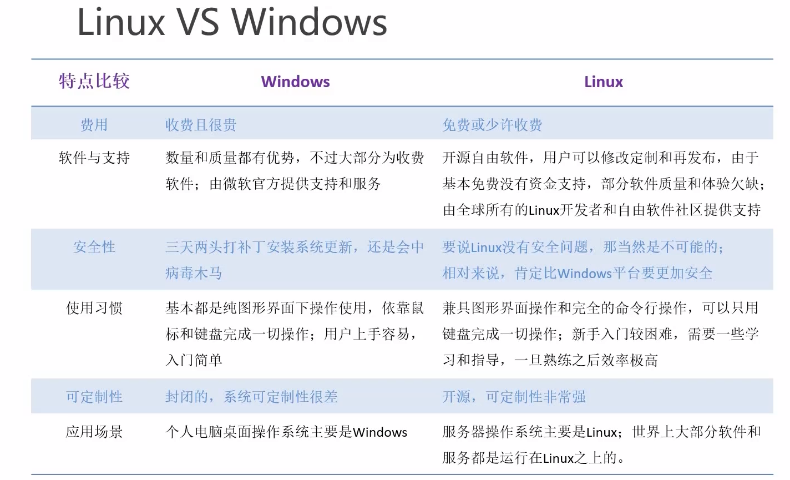

# 入门篇

## Linux v.s. Windows



# 基础篇

## Linux文件
Linux中一切皆文件

## Linux 文件目录
根目录：/
bin：二进制，机器码，直接可以执行的常用命令
sbin：系统级的二进制命令
lib/lib64：类似system/system32，重要的系统需要的动态链接库文件。应用程序需要的共享库
dev：设备目录，设备需要的文件映射
etc：系统管理需要的配置文件
home：包含每个用户的主文件夹
root：超级管理员的主文件夹。包括文档，下载等等

## VIM编辑器
一般模式（删除、复制、粘贴） ---- i, a或者o ----> 编辑模式（编辑文本）----- :或者 / ----> 命令模式


### 一般模式
```u``` 撤回操作  
```yy``` 复制 e.g. ```8yy``` 复制8行；  ```y$``` 复制当前光标到行末尾； ```y^``` 复制行开头到当前光标之前的内容； ```yw``` 复制当前光标位置开始到单词结束
```p``` 粘贴  
```d``` 删除  
```x``` 剪切  
```r``` 单个字符替换  
```^``` 光标移动到行头  
```$``` 移动到行尾  
```w``` 跳到下一个单词词头 ```e``` 跳到词尾  ```b``` 跳到上一个词头  
```gg``` 跳到整个文档开头  行号+G跳到任意行

###　编辑模式  

### 命令模式
:w 写入  :q 退 :q! 强退  
:set nu 显示行号  :set nonu 不显示

/ 查找  n下一个位置  
:s/boot/booot 把光标所在行的第一个匹配到的boot改为booot  
:s/boot/booot/g 当前行所有boot替换booot  
:%s/boot/booot/g 全篇文档所有都替换


# Shell 编程

## 脚本常用的执行方式

1. bash / sh 脚本相对路径 / 绝对路径  （相当于创建子shell）  
2. chmod +x + 路径 ;  
  直接输入路径执行 （相当于创建子shell）  
3. source / . + 路径 （一行一行解析，直接执行）  
 
如果改了环境变量没执行，直接source 刚刚修改过的file执行。因为子shell中的环境变量在父shell中不显示。

## 变量

#### 常用系统变量
$HOME, $PWD, $SHELL, $USER.  

e.g., 查看系统变量的值 ```echo $HOME```  
      显示当前Shell中所有变量 ```set```  

#### 自定义变量
1) 定义变量: 变量名=变量值，注意：=前后不能有空格
2) 撤销变量：unset变量名
3) 声明静态变量：readonly变量，注意：不能unset

export 导出子shell的变量

#### 特殊变量

- ***$n*** n 为数字，$0表示脚本名称，$1-$9表示1-9个参数，更多的用\${10}这种方式
- ***$#*** 获取输出如参数个数
- ***\$@, $\**** 所有参数（合，分）***"\$\*"*** 把所有参数当作整体
- ***&？*** 最后一次执行的命令的返回状态，0为正确执行 

## 运算符
\$((运算式子))， \$[运算式子]

## 条件判断

1) test condition
   echo $?
2) [condition]

注意：等号两边加空格，非空即为0（真），[　] 为 1（假的）  
　　　 -gt 大于，-lt 小于，-eq 等于
     中括号和条件判断式之间必须有空格

3) 按照文件权限进行判定  
　　[-r, -w, -x + 文件路径]

4) 按照文件名进行判断
　　[ -e 文件存在， -f 文件存在且是常规文件， -d 文件存在且是目录 ] 

5) 多条件判断 && 表示前一条命令执行成功才执行后一条  
　　　　　　|| 表示上一条执行失败才执行后一条  
e.g. ``` [ ] && echo OK || echo notOK```   打印notOK

## 流程控制

#### 分支语句
1) 单分支
``` if [ 条件判断 ]; then 
    程序
    fi
```

``` if [ 条件判断 ]
    then
        程序
    fi
```

2) 多分支

``` if [ 条件判断 ]
    then
        程序
    elif [ 条件判断 ]
    then
        程序
    else
        程序
    fi
```

注意：if后要有空格

3) case语句
```shell
case $变量名 in
"值 1")
    如果变量值等于值1 执行程序1
;;
"值 2")
    ........... 执行程序2
;;
...省略其他
*)
    相当于default 如果都不是以上的值则执行此程序
;;
esac
```

#### 循环语句

1) for循环

```shell
for (( 初始值; 循环控制条件; 变量变化 ))
do 
    程序
done
```

e.g.  
```shell
sum=0
for((i=0;i<=100;i++>))
do
    sum=$[$sum+$i]    
done
echo $sum
```

注意：双小括号括起可以直接用数学表达式  
e.g.  
```shell
if(($a > 2)); then echo OK; else echo notOK; fi
```

2) for in循环

```shell
for 变量 in 值1 值2 值3 ...
do
    程序
done
```

e.g.
```shell
for i in {1..100}; do sum=$[$sum+$i]; done; echo $sum
```


3) while循环
```shell
while [ 条件判断式 ]
do 
    程序
done
```

e.g.
```shell
a=1
while [ $a -le $1]
do
#    sum=$[$sum+$a]
#    a=$[a+1]
    let sum+=a
    let a++
done
echo $sum
```

## read读取控制台输入
read (选项) (参数)

- 选项：
  - -p 指定读取时的提示符
  - -t 指定读取值时等待的时间，如果不加-t则一直等待
- 参数：
  - 变量 指定读取值得变量名  

e.g.
```shell
read -t 7 -p "Enter your name in 7 seconds: " NN
echo $NN
```

## 函数

#### 系统函数
0) date  
```shell
date +%s
```
显示时间戳

1) basename
```shell
basename [string/pathname] [suffix]
```
删掉所有前缀包括最后一个('/')字符然后将字符串显示出来。相当于显示文件名。如果指定了suffix则会将suffix去掉并显示前面的。

2) dirname
相对应的，返回路径名字

```shell
echo script name: $(basename $0 .sh)
echo script path: $(cd $(dirname $0); pwd)
```
注：$(命令) 命令替换

#### 自定义函数

```shell
[function] funname[()]
{
    Action;
    [return int;]
}
``` 

- 必须在调用函数的地方先声明函数
- 函数返回值只能通过 $? 获得。可以显示加return返回，如果不加将以最后一条命令运行结果作为返回值。return 后跟数值n(0-255)

e.g.
```shell
function add(){
    s=$[$1 + $2]
    echo "和: " $s
}

read -p "请输入第一个数: " a
read -p "请输入第二个数：" b

add $a $b
```

```shell
#!/bin/bash
function add(){
    s=$[$1 + $2]
    echo "和: " $s
}

read -p "请输入第一个数: " a
read -p "请输入第二个数：" b

add $a $b
```

```shell
#!/bin/bash
function add(){
    s=$[$1 + $2]
    echo $s
}

read -p "请输入第一个数: " a
read -p "请输入第二个数：" b

sum=$(add $a $b))
echo "和：" $sum
```


## 综合案例

#### 归档文件

需求：实现一个每天对指定目录归档备份的脚本，输入一个目录名称，将目录下的所有文件按天归档保存并将归档日期附加在文件名上，放在/root/archive下
这里用到了归档命令tar 后面可以加上-c 选项表示归档，-z 表示压缩

- daili_archive.sh
```shell
# 首先判断输入参数个数是否为1

if [ $# -ne 1 ]
then
    echo "参数个数错误! 应输入一个参数作为归档目录名"
    exit
fi

# 从参数中获取目录名称
if [ -d $1 ]
then
    echo
else
    echo
    echo "目录不存在"
    echo 
    exit
fi

DIR_NAME=$(basename $1)
DIR_PATH=$(cd $(dirname $1); pwd)

# 获取当前日期
DATE=$(date +%y%m%d)

# 定义生成的归档文件名称
FILE=archive_${DIR_NAME}_$DATE.tar.gz
DEST=/root/archive/$FILE

# 开始归档
echo "开始归档"
tar -czf $DEST $DIR_PATH/$DIR_NAME

if [ $? -eq 0 ]
then
    echo
    echo "归档成功"
else
    echo "归档出现问题"
    echo
fi
exit
```
- 定时任务

```
crontab -l
```

```shell
# 每天晚上凌晨两点执行脚本

0 2 * * * /root/scripts/daily_archive.sh  /root/scripts
```

## 正则表达式

#### 常规匹配
e.g. 匹配所有包含xxx的行
```shell
cat /etc/passwd | grep xxx
```

#### 特殊字符

1)^ 匹配一行的开头
```shell
grep ^a
```
2) $ 匹配一行的结尾

e.g ^$ 匹配空行  

3) . 匹配任意字符

4) \* 表示出现0次或多次

5) []  [6,8] [0-9] [0-9]*

6) {} 精确重复次数   
e.g. 
```shell
grep -E ^1[34578][0-9]{9}$
```

## 文本处理工具

#### cut

cut [选项参数] filename

-f 列号  
-d 分隔符  
-c 按字符进行切割  

e.g. 获取ip地址
```shell
ifconfig ens33 | grep netmask | cut -d " " -f 10
```

#### awk

awk [选项参数] '/pattern1/{action1} /pattern2/{action2}...' filename

-F 指定输入文件分隔符  
-v 赋值一个用户定义变量  

内置变量  
FILENAME 文件名
NR 已读的记录数（行号）
NF 浏览的记录的域的个数（切割后列的个数）

e.g.
```shell
cat /etc/passwd | grep ^root | cut -d ":" -f 7    # /bin/bash
cat /etc/passwd | awk -F ":" '/^root/ {print $7}'
```

```shell
# 打印空行行号
ifconfig | grep -n ^$
ifconfig | awk '/^$/ {print NR}'
```