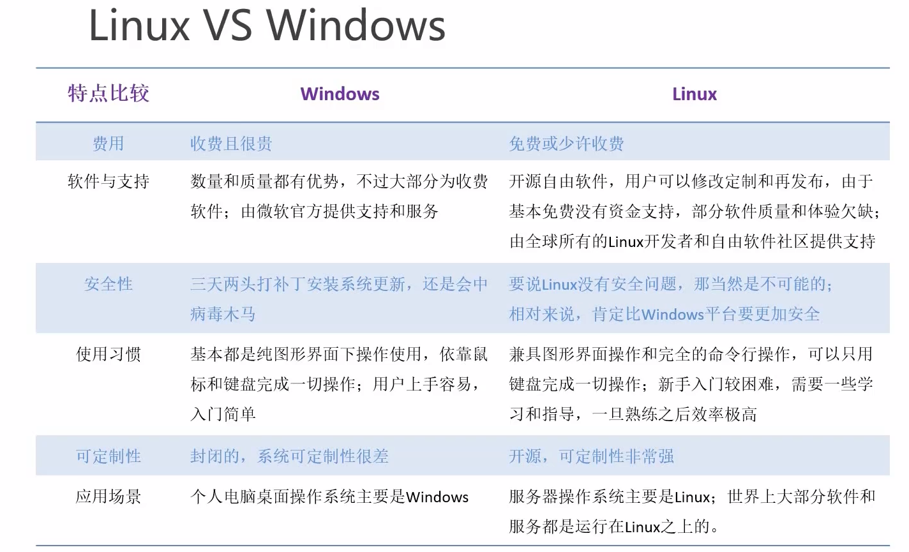

# 入门篇

## Linux v.s. Windows



# 基础篇

## Linux文件
Linux中一切皆文件

## Linux 文件目录
根目录：/
bin：二进制，机器码，直接可以执行的常用命令
sbin：系统级的二进制命令
lib/lib64：类似system/system32，重要的系统需要的动态链接库文件。应用程序需要的共享库
dev：设备目录，设备需要的文件映射
etc：系统管理需要的配置文件
home：包含每个用户的主文件夹
root：超级管理员的主文件夹。包括文档，下载等等

## VIM编辑器
一般模式（删除、复制、粘贴） ---- i, a或者o ----> 编辑模式（编辑文本）----- :或者 / ----> 命令模式


### 一般模式
```u``` 撤回操作  
```yy``` 复制 e.g. ```8yy``` 复制8行；  ```y$``` 复制当前光标到行末尾； ```y^``` 复制行开头到当前光标之前的内容； ```yw``` 复制当前光标位置开始到单词结束
```p``` 粘贴  
```d``` 删除  
```x``` 剪切  
```r``` 单个字符替换  
```^``` 光标移动到行头  
```$``` 移动到行尾  
```w``` 跳到下一个单词词头 ```e``` 跳到词尾  ```b``` 跳到上一个词头  
```gg``` 跳到整个文档开头  行号+G跳到任意行

###　编辑模式  

### 命令模式
:w 写入  :q 退 :q! 强退  
:set nu 显示行号  :set nonu 不显示

/ 查找  n下一个位置  
:s/boot/booot 把光标所在行的第一个匹配到的boot改为booot  
:s/boot/booot/g 当前行所有boot替换booot  
:%s/boot/booot/g 全篇文档所有都替换